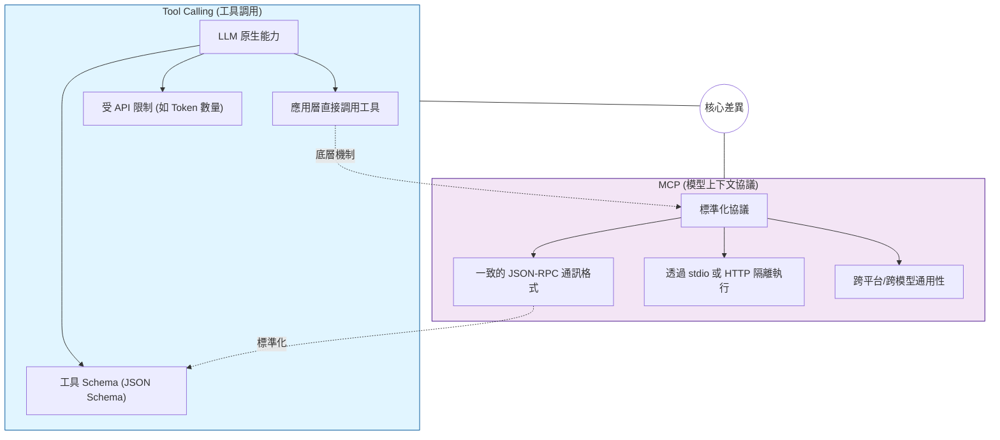
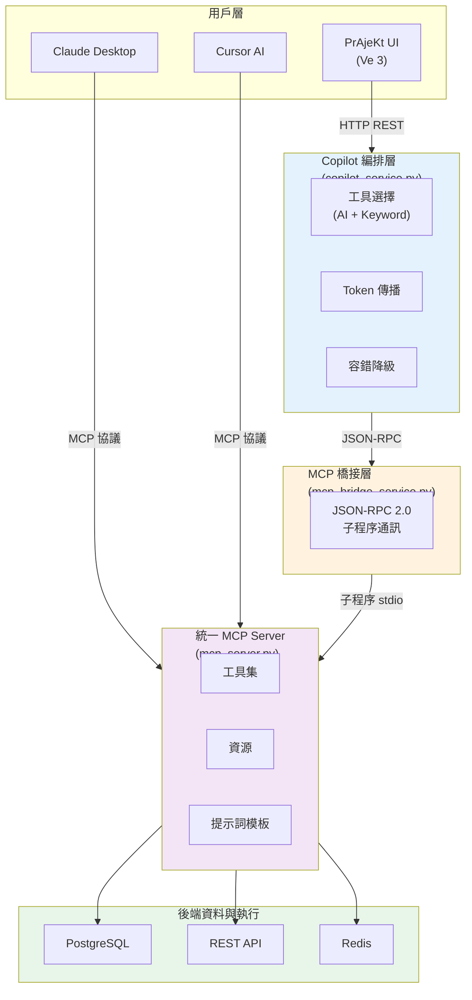

# MCP + Tool Calling 整合指南（PrAjeKt 專用）

**總覽文檔**：彙整 3 份文檔的精髓，解答「MCP 與 Tool Calling 的關係」、「為什麼 PrAjeKt 用 MCP」、「如何測試和部署」

**發行日期**: 2026/04/06  
**版本**: 1.0  
**目標**: 讓你完整理解 PrAjeKt 的 MCP 工具系統，無知識缺漏

---

## 📑 快速導航

| 你想了解 | 看這裡 |
|---|---|
| **MCP vs Tool Calling 有什麼差別？** | [1. MCP 與 Tool Calling 的關係](#1-mcp-與-tool-calling-的關係) |
| **PrAjeKt 為什麼選擇 MCP？** | [2. PrAjeKt 的決策與架構](#2-prajekt-的決策與架構) |
| **PrAjeKt 當前有哪些工具？** | [3. PrAjeKt 的工具生態](#3-prajekt-的工具生態清單) |
| **怎麼測試我寫的 MCP 工具？** | [4. 開發 / 測試 / 部署實踐](#4-開發--測試--部署實踐指南) |
| **JSON-RPC 2.0 錯誤回應怎麼處理？** | [💡 JSON-RPC 2.0 錯誤回應標準](#-json-rpc-20-錯誤回應標準) |
| **怎麼量測效能和監控？** | [5. 監控與效能指標](#5-監控與效能指標設計) |
| **要怎樣才能用 LangGraph？** | [6. 與 AI 框架的整合](#6-與-ai-框架的整合langraph--langchain) |
| **生產環境要怎麼部署？** | [7. 生產部署檢查清單](#7-生產部署檢查清單) |

---

## 1. MCP 與 Tool Calling 的關係

### 1.1 核心區別（概念層）



### 1.2 對比表

| 維度 | Tool Calling | MCP |
|---|---|---|
| **定義層次** | LLM 原生能力 | 通訊協議標準 |
| **執行環境** | 應用層直接 | 隔離子程序 / 遠端服務 |
| **可寫性** | API 定義工具 Schema | 標準化 Server 實作 |
| **共享性** | 特定 LLM 專用 | "Write Once, Use Everywhere" |
| **安全性** | LLM 直接訪問 | 可加密、按權限隔離 |
| **適用場景** | 單一應用、有 API 限制 | 複雜系統、需跨平台 |

### 1.3 實際組合：MCP 上邊套 Tool Calling

在 **PrAjeKt Phase 6.3+** 中的實際流程：

```
使用者自然語言輸入
    ↓
前端發送到 Copilot 編排層
    ↓
Copilot 決定使用哪個 MCP 工具 ← 這裡用 Tool Calling 邏輯（由 LLM 或關鍵字選擇）
    ↓
MCP 橋接層透過 JSON-RPC 執行工具 ← 這裡是 MCP 協議
    ↓
工具返回結果
    ↓
LLM 製作最終回答
```

**關鍵洞察**：
- MCP 定義了「**如何安全溝通**」
- Tool Calling 定義了「**LLM 如何決策**」
- 兩者不矛盾，可以層層組合

---

## 2. PrAjeKt 的決策與架構

### 2.1 為什麼 PrAjeKt 選 MCP 而不直接用 Tool Calling API？

**背景**：Claude API 和 OpenAI API 都原生支援 Tool Calling，為什麼 PrAjeKt 還要額外加 MCP 層？

**答案**：

| 考量 | 直接 API Tool Calling | MCP 方案 |
|---|---|---|
| **工具複用** | 只能給那個 LLM 用 | 任何支援 MCP 的應用都能用 ✓ |
| **隔離性** | 直接訪問應用進程 | 子程序隔離，更安全 ✓ |
| **動態工具** | 修改 code 重新部署 | 動態發現新工具，無需重啟 ✓ |
| **監控日誌** | 散落各處 | 統一的 MCP 通訊日誌 ✓ |
| **多 LLM 支援** | 為每個 LLM 適配一遍 | 統一介面，MCP 新手快速接入 ✓ |
| **前置研發成本** | 低 | 稍高（但長期收益大） |

**決策邏輯**：PrAjeKt 是**長期建設的專案平台**，不只是短期聊天應用，因此值得投資「標準化工具系統」。

### 2.2 PrAjeKt 的架構決策



**核心特性**：
1. **外層開放** - Claude Desktop、Cursor 等外部工具可直接連
2. **中層橋接** - MCP 子程序隔離，統一通訊協議
3. **內層編排** - Copilot 服務負責智能選擇和容錯
4. **數據安全** - 工具不直接暴露，所有訪問經過編排層

---

## 3. PrAjeKt 的工具生態清單

### 3.1 Phase 6.3+ 的 4 個已實裝工具

#### 工具 1: `timeline_generate_tasks` ✅

```python
@server.call_tool()
def call_timeline_generate_tasks(
    timeline_id: int,
    project_name: str,
    description: str
) -> str:
    """使用 Gemini AI 生成任務建議"""
```

**用途**：AI 智能為 Timeline 建議新任務  
**調用者**：Copilot 編排層  
**範例**：
```json
{
  "timeline_id": 42,
  "project_name": "Phase 6.4 Group Sync",
  "description": "Generate backend roadmap for Q2"
}
```

---

#### 工具 2: `timeline_batch_create_tasks` ✅

```python
@server.call_tool()
def call_timeline_batch_create_tasks(
    timeline_id: int,
    tasks: list[dict]
) -> str:
    """批量建立或保留任務"""
```

**用途**：將生成的任務批量落地到資料庫  
**調用者**：Copilot 編排層（自動建立時）  
**範例**：
```json
{
  "timeline_id": 42,
  "tasks": [
    {"name": "Setup repo", "priority": "high"},
    {"name": "Write schema", "priority": "medium"}
  ]
}
```

---

#### 工具 3: `task_comment_summary` ✅

```python
@server.call_tool()
def call_task_comment_summary(task_id: int) -> str:
    """生成任務評論摘要"""
```

**用途**：AI 總結某個任務的所有討論  
**調用者**：AI 助理、Copilot  
**意義**：快速了解任務進度不用讀完所有評論

---

#### 工具 4: `group_snapshot` ✅

```python
@server.call_tool()
def call_group_snapshot(
    group_id: int,
    window_days: int = 30
) -> str:
    """生成群組 AI 快照"""
```

**用途**：AI 分析群組在指定時間的活動總結  
**調用者**：AI 助理、RAG-B 功能  
**意義**：支援「群組週回顧」等高級功能

---

### 3.2 工具生態路線圖 (Phase 6.4+)

#### Phase 6.4: 群組聯動（待開始）

規劃新增工具：
- `group_create_task_from_chat` - 群聊中一鍵建任務
- `group_assign_task_to_member` - 自動分配任務給群成員
- `group_generate_roadmap` - 群組層級的路線圖生成

#### Phase 6.5: RAG-C 個人週回顧（待開始）

規劃新增工具：
- `user_generate_weekly_review` - 個人週回顧報告
- `user_get_performance_metrics` - 用戶效能指標
- `user_generate_recommendations` - AI 個人化建議

#### Phase 7.0: 企業級功能（中期規劃）

規劃新增工具：
- `batch_export_timelines` - 匯出報告
- `batch_update_permissions` - 批量權限管理
- `audit_log_query` - 審計日誌查詢

---

## 4. 開發 / 測試 / 部署實踐指南

### 4.1 開發新 MCP 工具的流程

#### Step 1: 定義工具 Schema

```python
from mcp.server.fastmcp import FastMCP

mcp = FastMCP("my-server")

@mcp.tool()
def my_new_tool(
    required_param: str,
    optional_param: int = 10,
    enum_param: str = "default"
) -> str:
    """簡潔但完整的說明文字。
    
    ⚠️ 重點：
    1. 每個參數都要有型別提示
    2. 說明要 Gemini 能理解的邏輯，不要太技術
    3. 單一職責：一個工具只做一件事
    
    Args:
        required_param: 必填參數說明
        optional_param: 可選參數，預設值 10
        enum_param: 枚舉參數 (可選: "option1", "option2")
    
    Returns:
        遵循 JSON-RPC 2.0 格式的響應（見下方標準說明）
    """
    # 業務邏輯直接執行，異常由 FastMCP 自動轉換為 JSON-RPC 錯誤
    # 無需手動 try-except！
    result = some_business_logic(required_param, optional_param, enum_param)
    return result
```

**最佳實踐**：
- 參數盡量少（3 個以內最好）
- 用 enum 而不是自由文本欄位
- **不需要手動 try-except**，FastMCP 會自動處理（見下方標準說明）

---

#### 💡 JSON-RPC 2.0 錯誤回應標準

MCP 使用 **JSON-RPC 2.0** (RFC 7632) 來規範所有的通訊格式。

**成功回應**：
```json
{
  "jsonrpc": "2.0",
  "id": 1,
  "result": {
    "status": "completed",
    "data": {...}
  }
}
```

**錯誤回應**（FastMCP 自動生成）：
```json
{
  "jsonrpc": "2.0",
  "id": 1,
  "error": {
    "code": -32603,
    "message": "Internal error",
    "data": {
      "traceback": "...",
      "exception_type": "ValueError"
    }
  }
}
```

**錯誤碼對照表**（由 FastMCP 自動指派）：

| 錯誤碼 | 含義 | 範例 |
|---|---|---|
| `-32600` | Invalid Request | 參數型別錯誤 |
| `-32601` | Method not found | 工具不存在 |
| `-32602` | Invalid params | 必填參數缺失 |
| `-32603` | Internal error | 業務邏輯異常 |
| `-32700` | Parse error | JSON 反序列化失敗 |

**重點**：`result` 和 `error` 互斥（只會出現其中一個）

**實現範例**（你不需要寫 try-except）：
```python
@mcp.tool()
def group_snapshot(group_id: int, window_days: int = 30) -> dict[str, Any]:
    """生成群組 AI 快照。"""
    
    # ❌ 不要這樣寫：
    # try:
    #     ...
    # except Exception as e:
    #     return {"error": "..."}  ← 錯誤格式！
    
    # ✅ 直接拋出異常，FastMCP 會轉換為正確的 JSON-RPC 2.0 錯誤：
    if group_id <= 0:
        raise ValueError("group_id 必須是正整數")
    
    # 如果 API 呼叫失敗，異常也會被捕捉：
    client = _build_client()
    status_code, payload = client.call_api(
        "POST",
        f"/groups/{group_id}/ai-snapshot",
        payload={"window_days": window_days},
        accept_status={200}
        # ↑ 非預期狀態碼會拋出 PrAjeKtApiError，自動轉換為 JSON-RPC 錯誤
    )
    
    return payload  # ← 成功時返回業務結果，FastMCP 包裹成 JSON-RPC response
```

**前端接收時的處理**（TypeScript）：
```typescript
// response.error 存在時代表失敗
if (response.error) {
  console.error(`[${response.error.code}] ${response.error.message}`);
  if (response.error.data?.traceback) {
    console.error("Stack trace:", response.error.data.traceback);
  }
} else {
  // response.result 才是業務數據
  console.log("Success:", response.result);
}
```

#### Step 2: 撰寫單元測試

```python
import pytest
from mcp_server import group_snapshot

class TestGroupSnapshot:
    """測試 group_snapshot"""
    
    def test_success_case(self):
        """正常情況：有效的 group_id"""
        result = group_snapshot(group_id=1, window_days=30)
        
        # FastMCP 工具直接返回 Python 對象，不是 JSON 字串
        assert isinstance(result, dict)
        assert "mode" in result
        assert result["mode"] in ["sync", "async"]
    
    def test_invalid_group_id(self):
        """異常情況：無效的 group_id"""
        with pytest.raises(ValueError, match="group_id 必須是正整數"):
            group_snapshot(group_id=0, window_days=30)
    
    def test_invalid_window_days(self):
        """邊界情況：無效的 window_days"""
        with pytest.raises(ValueError, match="window_days 必須是正整數"):
            group_snapshot(group_id=1, window_days=0)
    
    def test_api_failure(self):
        """異常情況：後端 API 返回錯誤"""
        # 若 API 呼叫失敗，會拋出 PrAjeKtApiError
        with pytest.raises(PrAjeKtApiError):
            group_snapshot(group_id=999, window_days=30)
```

**執行測試**：
```bash
pytest backend/tests/test_mcp_tools.py::TestGroupSnapshot -v
```

**測試結果驗證**：
- ✅ 成功路徑返回 `dict`（Python 對象）
- ✅ 異常情況拋出 `ValueError` 或 `PrAjeKtApiError`
- ✅ FastMCP 會自動將異常轉換為 JSON-RPC 2.0 error

> **重點**：單元測試中直接呼叫工具函式（測試 Python 層面），JSON-RPC 轉換發生在 MCP 通訊層。

#### Step 3: 本地測試工具

**方法 A：使用 MCP Inspector**

```bash
# 提供一個簡單的 UI 來測試工具
npx @modelcontextprotocol/inspector python mcp_server.py
```

**功能**：
- ✅ 查看所有可用工具
- ✅ 點擊工具，填參數
- ✅ 看底層 JSON-RPC 通訊
- ✅ 檢查回應

**操作步驟**：
1. 終端執行上述命令
2. 瀏覽器自動開啟 `localhost:5000`
3. 在左邊選工具，右邊填參數
4. 按 "Call Tool" 測試
5. 看 "Raw Message" 檢查 JSON-RPC 格式

**方法 B：手動 JSON-RPC 測試（進階用）**

```python
import subprocess
import json

def test_tool_via_jsonrpc():
    """直接透過 JSON-RPC 呼叫工具"""
    
    proc = subprocess.Popen(
        ["python", "mcp_server.py"],
        stdin=subprocess.PIPE,
        stdout=subprocess.PIPE,
        stderr=subprocess.PIPE,
        text=True
    )
    
    # 初始化
    init_msg = {
        "jsonrpc": "2.0",
        "id": 1,
        "method": "initialize",
        "params": {
            "protocolVersion": "2024-11-05",
            "clientInfo": {"name": "TestClient", "version": "1.0"}
        }
    }
    proc.stdin.write(json.dumps(init_msg) + "\n")
    proc.stdin.flush()
    response = proc.stdout.readline()
    print(f"Init response: {response}")
    
    # 呼叫工具
    tool_msg = {
        "jsonrpc": "2.0",
        "id": 2,
        "method": "tools/call",
        "params": {
            "name": "my_new_tool",
            "arguments": {
                "required_param": "test",
                "optional_param": 25,
                "enum_param": "option1"
            }
        }
    }
    proc.stdin.write(json.dumps(tool_msg) + "\n")
    proc.stdin.flush()
    response = proc.stdout.readline()
    print(f"Tool response: {response}")
    
    proc.stdin.close()
    proc.wait()
```

#### Step 4: 集成測試（前後端）

```python
import asyncio
from flask import Flask
from mcp import ClientSession, StdioServerParameters
from mcp.client.stdio import stdio_client

async def test_copilot_mcp_integration():
    """測試完整的 Copilot MCP 流程"""
    
    server_params = StdioServerParameters(
        command="python",
        args=["./mcp_server.py"]
    )
    
    async with stdio_client(server_params) as (read, write):
        async with ClientSession(read, write) as session:
            await session.initialize()
            
            # 列出所有工具，確認我們的新工具在列表中
            tools_response = await session.list_tools()
            tool_names = [t.name for t in tools_response.tools]
            
            assert "my_new_tool" in tool_names, "新工具未被發現"
            
            # 呼叫我們的新工具
            result = await session.call_tool(
                "my_new_tool",
                {"required_param": "test", "optional_param": 25}
            )
            
            # 驗證回應格式
            result_text = result.content[0].text
            result_json = json.loads(result_text)
            
            assert result_json["status"] == "success"
            print("✅ 集成測試通過")

# 執行
asyncio.run(test_copilot_mcp_integration())
```

### 4.2 部署新工具到 PrAjeKt

#### 部署清單

- [ ] 工具已通過單元測試（100% 覆蓋高風險路徑）
- [ ] 工具已通過 MCP Inspector 測試
- [ ] 工具已在集成測試通過
- [ ] 錯誤處理完整（無 try-except 空缺）
- [ ] 返回格式統一（JSON，含 status/error_code）
- [ ] 工具說明文字清楚（Gemini 能理解）
- [ ] 敏感操作有權限檢查（若適用）
- [ ] 性能測試通過（見下一節監控指標）

#### 部署步驟

1. **合併到 main**

```bash
git add mcp_server.py backend/tests/test_mcp_tools.py
git commit -m "feat: add my_new_tool to MCP server"
git push origin phase-6.4-my-new-tool
# 建立 PR，通過 code review
```

2. **驗證部署**

```bash
# 重啟 MCP Server
systemctl restart prajekt-mcp-server

# 檢查新工具是否可發現
curl http://localhost:5000/api/mcp/tools
# 應該在列表中看到 "my_new_tool"
```

3. **監控初期的錯誤率**

```python
# 日誌中監控該工具的呼叫
grep "my_new_tool" /var/log/prajekt/mcp_bridge.log | tail -100
```

---

## 5. 監控與效能指標設計

### 5.1 核心指標定義

#### 指標 1: Tool Selection Accuracy（工具選擇正確率）

```python
# 定義
tool_selection_accuracy = (correct_selections / total_selections) * 100

# 如何量測
# 每次 Copilot 編排層選擇工具時，記錄：
# - 用戶需求
# - 選擇的工具名
# - 結果是否滿足用戶期望

# 範例日誌
{
    "timestamp": "2026-04-06T10:30:00Z",
    "user_message": "Generate Q2 roadmap",
    "selected_tool": "timeline_generate_tasks",
    "selection_method": "ai",  # 或 "keyword"
    "success": true,
    "duration_ms": 2340
}
```

#### 指標 2: Tool Success Rate（工具執行成功率）

```python
# 定義
tool_success_rate = (successful_calls / total_calls) * 100

# 分類統計
# - 成功 (200): 工具執行完成，回傳結果
# - 參數錯誤 (400): 參數驗證失敗
# - 工具錯誤 (500): 工具內部異常
# - 超時 (504): 工具執行超過閾值

# 範例指標
metrics = {
    "timeline_generate_tasks": {
        "total_calls": 245,
        "success": 243,
        "param_error": 1,
        "tool_error": 1,
        "timeout": 0,
        "success_rate": 99.18,
        "avg_latency_ms": 1850,
        "p95_latency_ms": 3200,
        "p99_latency_ms": 4100
    }
}
```

#### 指標 3: Parameter Validation Pass Rate（參數驗證通過率）

```python
# 定義
param_validation_pass_rate = (valid_params / total_params) * 100

# 監控項目
# - 缺少必填參數
# - 參數型別不符
# - 參數值超出範圍
# - enum 值不在清單中

# 如果驗證通過率 < 90%，表示：
# 1. 工具 Schema 定義不清（Gemini 難以理解）
# 2. 或是 Gemini 經常生成錯誤參數
```

#### 指標 4: Latency Distribution（延遲分佈）

```python
# 監控分位數
latency_metrics = {
    "p50": 800,     # 50% 的呼叫在 800ms 以內
    "p90": 2000,    # 90% 的呼叫在 2000ms 以內
    "p95": 3200,    # 95% 的呼叫在 3200ms 以內
    "p99": 5000,    # 99% 的呼叫在 5000ms 以內
    "max": 12500    # 最長的呼叫耗時
}

# 目標
# - 平均 < 2000ms
# - p95 < 4000ms
# 如果突破目標，分析原因：
# - 資料庫查詢慢？ → 加索引
# - Gemini 回應慢？ → 加快 token 限制
# - 子程序啟動慢？ → 考慮常駐程序
```

### 5.2 實現監控的代碼架構

#### Schema 1: 統一的工具執行日誌

```python
# backend/services/mcp_bridge_service.py 中加入

import logging
import time
from datetime import datetime

mcp_logger = logging.getLogger("mcp_tools")

class MCPExecutionTracer:
    """追蹤 MCP 工具執行"""
    
    def __init__(self, tool_name: str):
        self.tool_name = tool_name
        self.start_time = time.time()
    
    def log_execution(self, status: str, result: dict = None, error: str = None):
        """記錄工具執行結果"""
        duration_ms = (time.time() - self.start_time) * 1000
        
        log_entry = {
            "timestamp": datetime.now().isoformat(),
            "tool_name": self.tool_name,
            "status": status,  # "success" / "error" / "timeout"
            "duration_ms": duration_ms,
            "result": result,
            "error": error
        }
        
        mcp_logger.info(json.dumps(log_entry))
        return log_entry

# 使用方式
tracer = MCPExecutionTracer("timeline_generate_tasks")
try:
    result = execute_mcp_tool(...)
    tracer.log_execution("success", result=result)
except TimeoutError as e:
    tracer.log_execution("timeout", error=str(e))
except Exception as e:
    tracer.log_execution("error", error=str(e))
```

#### Schema 2: 定期指標聚合

```python
# backend/services/metrics_aggregator.py

class MetricsAggregator:
    """每分鐘聚合一次指標"""
    
    def __init__(self):
        self.metrics = {}
    
    def aggregate_from_logs(self, log_lines: list[str]):
        """從日誌聚合指標"""
        
        for log in log_lines:
            entry = json.loads(log)
            tool_name = entry["tool_name"]
            
            if tool_name not in self.metrics:
                self.metrics[tool_name] = {
                    "total": 0,
                    "success": 0,
                    "error": 0,
                    "timeout": 0,
                    "latencies": []
                }
            
            self.metrics[tool_name]["total"] += 1
            self.metrics[tool_name]["latencies"].append(
                entry["duration_ms"]
            )
            
            if entry["status"] == "success":
                self.metrics[tool_name]["success"] += 1
            elif entry["status"] == "timeout":
                self.metrics[tool_name]["timeout"] += 1
            else:
                self.metrics[tool_name]["error"] += 1
    
    def compute_percentiles(self):
        """計算分位數"""
        for tool_name, data in self.metrics.items():
            latencies = sorted(data["latencies"])
            data["p50"] = latencies[len(latencies) // 2]
            data["p95"] = latencies[int(len(latencies) * 0.95)]
            data["p99"] = latencies[int(len(latencies) * 0.99)]
            data["avg"] = sum(latencies) / len(latencies)
    
    def export_to_prometheus(self):
        """匯出為 Prometheus 格式"""
        lines = []
        for tool_name, data in self.metrics.items():
            lines.append(
                f'mcp_tool_success_rate{{tool="{tool_name}"}} '
                f'{(data["success"] / data["total"] * 100):.2f}'
            )
            lines.append(
                f'mcp_tool_p95_latency_ms{{tool="{tool_name}"}} '
                f'{data["p95"]:.0f}'
            )
        return "\n".join(lines)
```

### 5.3 監控儀表板範本

```python
# 簡單的 Flask 端點
@app.route('/api/mcp/metrics')
def get_mcp_metrics():
    """返回當前 MCP 工具指標"""
    return jsonify({
        "snapshot": {
            "timestamp": datetime.now().isoformat(),
            "tools": [
                {
                    "name": "timeline_generate_tasks",
                    "total_calls": 245,
                    "success_rate": 99.18,
                    "avg_latency_ms": 1850,
                    "p95_latency_ms": 3200,
                    "status": "healthy"  # healthy / degraded / error
                },
                {
                    "name": "timeline_batch_create_tasks",
                    "total_calls": 198,
                    "success_rate": 98.99,
                    "avg_latency_ms": 920,
                    "p95_latency_ms": 1800,
                    "status": "healthy"
                }
            ]
        }
    })
```

---

## 6. 與 AI 框架的整合（LangGraph / LangChain）

### 6.1 為什麼考慮 LangGraph？

現在 PrAjeKt 已經有了：
- ✅ MCP tools 定義好
- ✅ Copilot 編排層做了工具選擇
- ✅ 基本的執行迴圈

**下一步的問題**：
- 複雜多工具流程難以管理（目前是線性的）
- 工具間的狀態傳遞容易出錯
- 難以實現「決策樹」邏輯（例如：if 結果 A，then 呼叫工具 B；else 呼叫工具 C）

**LangGraph 的價值**：
- 用狀態圖定義流程（更清晰）
- 內建重試、人工介入、條件分支
- 可視化流程，除錯更容易

### 6.2 LangGraph 與 MCP 的整合方式

```python
from langgraph.graph import StateGraph, START, END
from langgraph.graph.message import add_messages
from typing import Annotated
import anthropic

# 定義狀態
class AgentState:
    messages: Annotated[list, add_messages]
    tool_results: dict = {}
    next_step: str = "decide"

# 建立狀態圖
graph = StateGraph(AgentState)

# Node 1: 決策層，呼叫 LLM 決定用哪個 MCP 工具
def decide_tool(state: AgentState):
    client = anthropic.Anthropic()
    
    # 列出可用 MCP 工具
    mcp_tools = list_available_mcp_tools()  # 從 MCP Server 取得
    
    response = client.messages.create(
        model="claude-3-5-sonnet-20241022",
        max_tokens=1024,
        tools=mcp_tools,
        messages=state.messages
    )
    
    # 檢查是否要呼叫工具
    if response.stop_reason == "tool_use":
        tool_use = next(c for c in response.content if c.type == "tool_use")
        return {
            "messages": state.messages + [{"role": "assistant", "content": response.content}],
            "selected_tool": tool_use.name,
            "tool_args": tool_use.input,
            "next_step": "execute"
        }
    else:
        # 直接回答
        return {
            "messages": state.messages + [{"role": "assistant", "content": response.content}],
            "next_step": "end"
        }

# Node 2: 執行工具
async def execute_tool(state: AgentState):
    tool_name = state["selected_tool"]
    tool_args = state["tool_args"]
    
    # 透過 MCP 橋接執行工具
    result = await call_mcp_tool(tool_name, tool_args)
    
    return {
        "messages": state.messages + [{
            "role": "user",
            "content": [{"type": "tool_result", "content": result}]
        }],
        "tool_results": {**state["tool_results"], tool_name: result},
        "next_step": "decide"  # 回到決策層，看是否要再呼叫其他工具
    }

# Node 3: 終止
def end(state: AgentState):
    return state

# 構建圖
graph.add_node("decide", decide_tool)
graph.add_node("execute", execute_tool)
graph.add_node("end", end)

graph.add_edge(START, "decide")
graph.add_conditional_edges(
    "decide",
    lambda x: x["next_step"],
    {"execute": "execute", "end": "end"}
)
graph.add_edge("execute", "decide")

app = graph.compile()

# 使用
async def run_agent(user_input: str):
    result = await app.ainvoke({
        "messages": [{"role": "user", "content": user_input}]
    })
    return result
```

**優點**：
- 清晰的流程圖，可以在 VS Code 可視化
- 自動支援「多輪工具呼叫」（工具之間互相依賴）
- 內建人工介入機制（高風險操作需要確認）

### 6.3 過渡計畫

| Phase | 當前狀態 | 新增 LangGraph |
|---|---|---|
| **Phase 6.3+（現在）** | MCP + 手工編排 | ← 你在這 |
| **Phase 6.5（規劃）** | 單工具迴圈 | 考慮 LangGraph 簡化 |
| **Phase 7.0（中期）** | 複雜多工具流程 | 遷移到 LangGraph 時機 |

建議：**先把 MCP 工具磨穩定，再考慮 LangGraph**。過早引入框架會增加複雜度。

---

## 7. 生產部署檢查清單

### 7.1 基礎設施準備

- [ ] MCP Server 以 systemd 服務方式持久運行
- [ ] 配置 stdout/stderr 重定向到日誌檔案
- [ ] 設定最大重試次數和超時時間
- [ ] 配置熔斷機制（連續失敗 N 次後暫停調用）

```bash
# 範例 systemd 單位文件
# /etc/systemd/system/prajekt-mcp-server.service

[Unit]
Description=PrAjeKt MCP Server
After=network.target

[Service]
Type=simple
User=prajekt
WorkingDirectory=/app/prajekt
ExecStart=/usr/bin/python3 /app/prajekt/mcp_server.py
Restart=on-failure
RestartSec=5s
# 日誌設定
StandardOutput=journal
StandardError=journal
# 資源限制
MemoryLimit=512M
CPUQuota=50%

[Install]
WantedBy=multi-user.target
```

### 7.2 監控和告警

- [ ] 日誌聚合（ELK / Loki）
- [ ] 指標收集（Prometheus）
- [ ] 告警規則：
  - 工具成功率 < 95% → Warning
  - 工具成功率 < 80% → Critical
  - p95 延遲 > 5000ms → Warning
  - 連續失敗次數 > 5 → Circuit Breaker

```yaml
# 範例告警規則 (Prometheus)
groups:
  - name: mcp_tools
    rules:
      - alert: MCPToolHighErrorRate
        expr: (1 - rate(mcp_tool_success[5m])) > 0.2
        for: 5m
        annotations:
          summary: "MCP tool error rate > 20%"
```

### 7.3 容錯機制

- [ ] 工具失敗時的自動重試（指數退避）
- [ ] 回退到關鍵字路由（AI 不可用時）
- [ ] 超時控制（工具執行 > 10 秒自動中止）
- [ ] 高風險工具（delete/update）需要人工確認

```python
def execute_with_fallback(tool_name: str, args: dict, access_token: str):
    """有層級的容錯執行"""
    
    Max_retries = 3
    for attempt in range(max_retries):
        try:
            return execute_mcp_tool(tool_name, args, access_token)
        except TimeoutError:
            if attempt < max_retries - 1:
                sleep(2 ** attempt)  # 指數退避
            else:
                # 最後一次失敗，回退
                return fallback_keyword_route(tool_name, args)
```

### 7.4 安全檢查清單

- [ ] MCP Server 以最小權限使用者運行（非 root）
- [ ] 敏感操作（刪除、寫入外部 API）需要權限檢查
- [ ] 所有工具入參數驗證在執行前進行
- [ ] Bearer token 只在環境變數中傳遞，不記錄到日誌
- [ ] 定期安全審計，檢查有無權限提升風險

```python
# 在 Copilot 編排層新增權限檢查
DESTRUCTIVE_TOOLS = {"delete_task", "delete_project", "reset_database"}

def filter_by_permissions(tool_name: str, user_id: str) -> bool:
    """檢查用戶是否有權調用該工具"""
    
    if tool_name in DESTRUCTIVE_TOOLS:
        user_role = get_user_role(user_id)
        if user_role not in ["admin", "owner"]:
            return False
    
    return True
```

---

## 8. 常見問題與回答

### Q1: PrAjeKt 用戶能否直接透過 Claude Desktop 連 PrAjeKt MCP Server？

**答**：可以！這是 MCP 的亮點之一。

配置步驟：
1. 確保 PrAjeKt MCP Server 可透過 stdio 啟動（已有）
2. 在 Claude Desktop 的 `claude_desktop_config.json` 中新增：

```json
{
  "mcpServers": {
    "prajekt": {
      "command": "python",
      "args": ["/path/to/prajekt/mcp_server.py"],
      "env": {
        "AUTHORIZATION_BEARER": "your_jwt_token"
      }
    }
  }
}
```

3. 重啟 Claude Desktop，就能看到 PrAjeKt 的所有工具

### Q2: 為什麼有時工具會卡住？

**常見原因**：
1. **資料庫連接池用完** → 增加連接池大小或優化查詢
2. **子程序啟動慢** → 考慮常駐 MCP Server
3. **Gemini 回應慢** → 檢查網路，或降低 token 限制
4. **無限迴圈** → 檢查 max_steps 設定

**疑難排解**：
```bash
# 查看詳細日誌
tail -f /var/log/prajekt/mcp_bridge.log | grep "timeout\|error"

# 檢查子程序狀態
ps aux | grep mcp_server

# 測試工具執行時間
time python -c "
import asyncio
from mcp_server import timeline_generate_tasks
asyncio.run(timeline_generate_tasks(42, 'Test', 'Test'))
"
```

### Q3: 如何添加新工具而不中斷現有服務？

**做法**：
1. 在開發分支新增工具
2. 本地用 Inspector 測試通過
3. 合併到 main
4. Systemd 會自動重啟 MCP Server
5. 新工具立即對所有客戶端（PrAjeKt UI、Claude Desktop 等）可用

**無中斷**：MCP 客戶端會在每次連接時重新查詢工具列表，所以舊連接斷開→重連→自動發現新工具

---

## 總結表

| 問題 | 答案所在 |
|---|---|
| MCP 是什麼？ | [1. MCP 與 Tool Calling 的關係](#1-mcp-與-tool-calling-的關係) |
| 為什麼用 MCP？ | [2. PrAjeKt 的決策與架構](#2-prajekt-的決策與架構) |
| 有哪些工具？ | [3. 工具生態清單](#3-prajekt-的工具生態清單) |
| 怎麼開發？ | [4. 開發 / 測試 / 部署](#4-開發--測試--部署實踐指南) |
| 怎麼監控？ | [5. 監控與效能指標](#5-監控與效能指標設計) |
| 是否能用 LangGraph？ | [6. 與 AI 框架的整合](#6-與-ai-框架的整合langraph--langchain) |
| 怎麼上線？ | [7. 生產部署](#7-生產部署檢查清單) |

---


