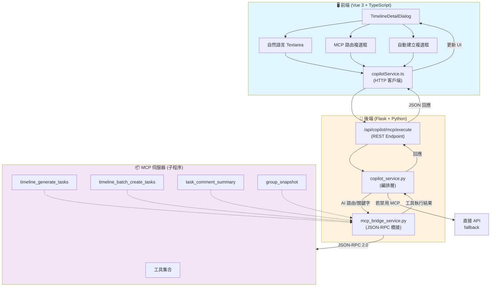
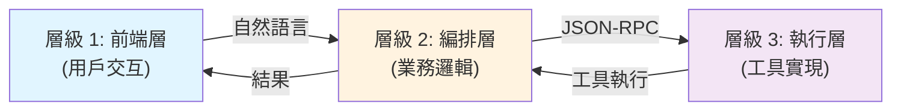
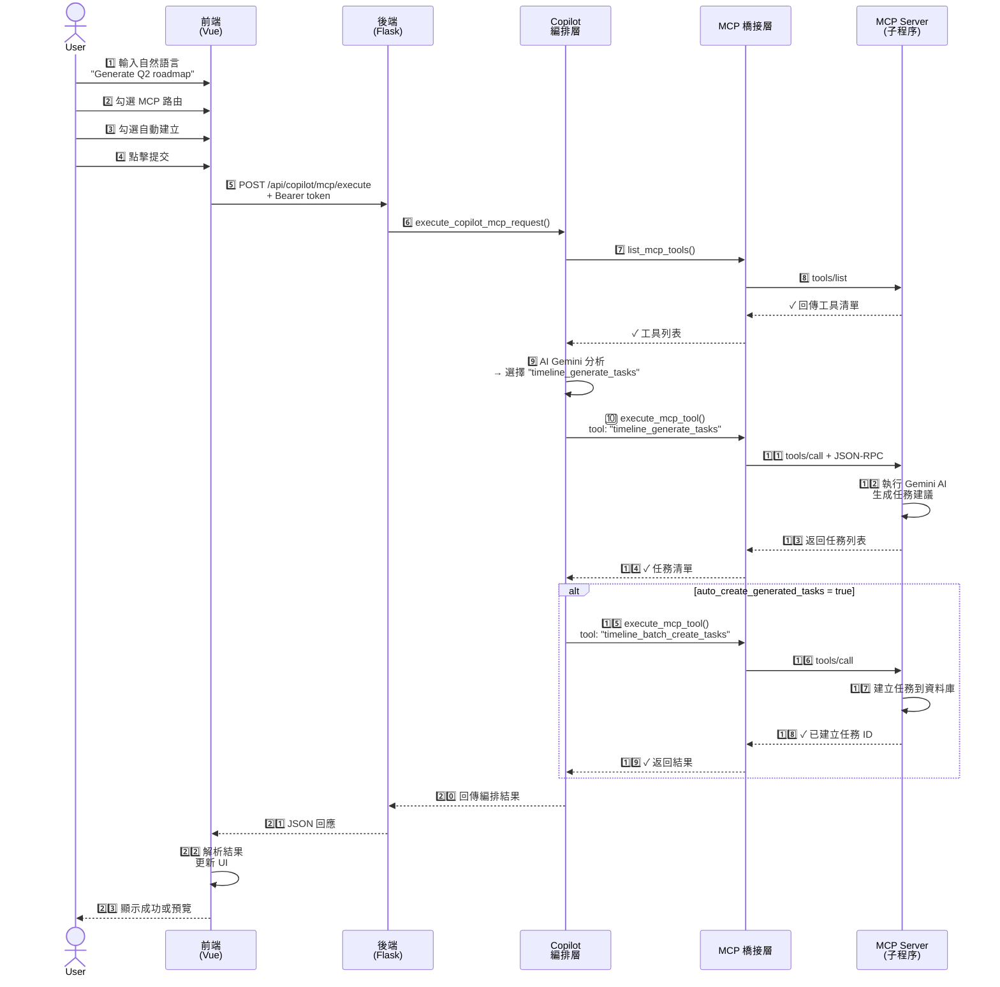
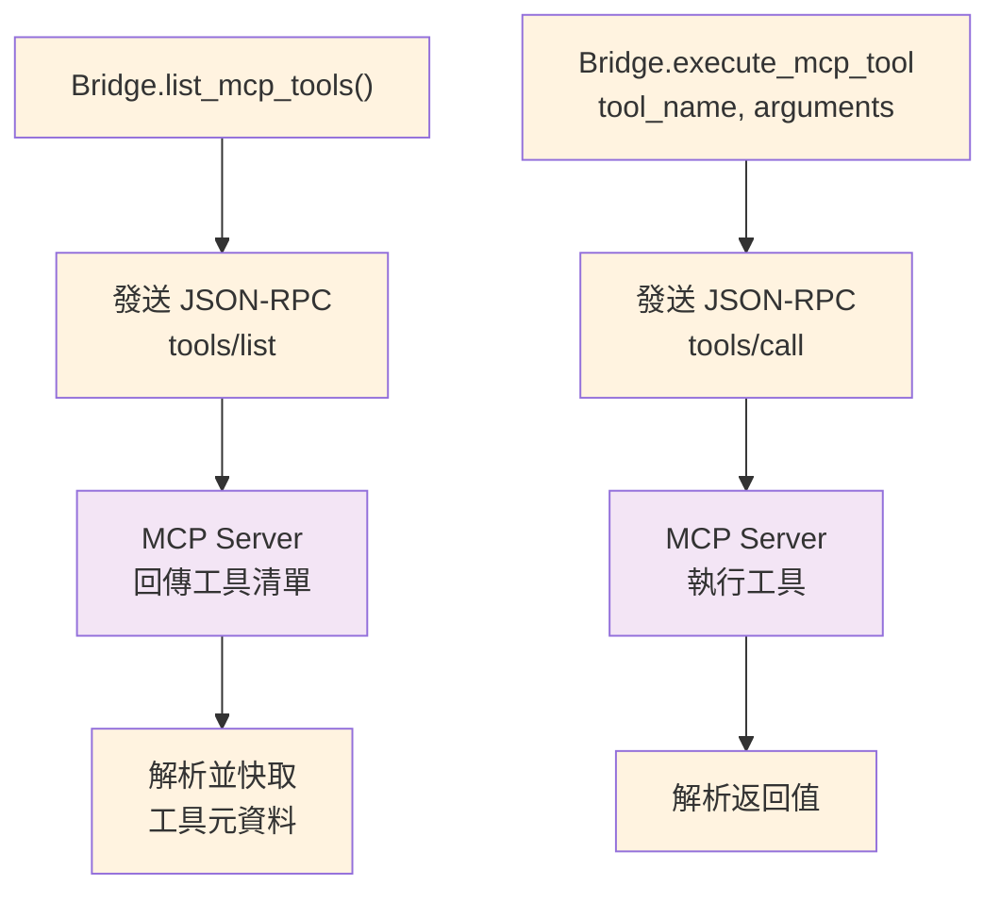
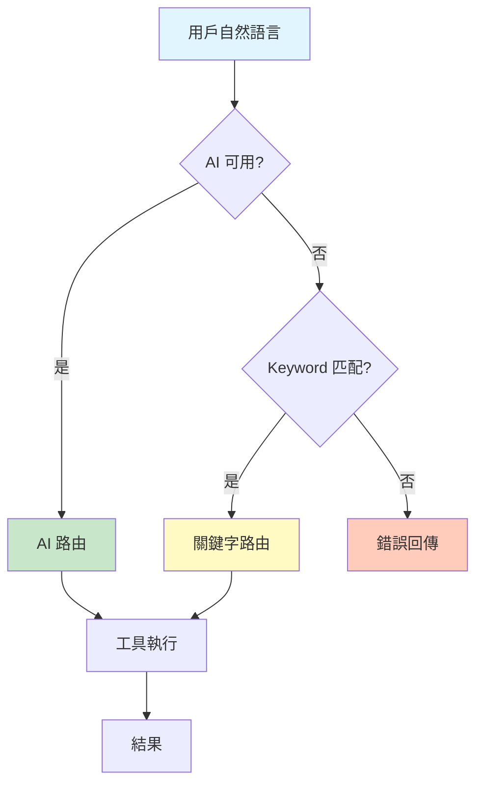

# Phase 6.3+ Copilot + MCP 整合詳解

**發行日期**: 2026/04/06  
**版本**: Phase 6.3+  
**目標**: 完整介紹 Copilot 和 MCP 整合架構、運作流程、以及實作細節

---

## 📑 目錄大綱

1. [概述](#概述)
2. [核心概念](#核心概念)
3. [系統架構](#系統架構)
4. [關鍵組件](#關鍵組件)
5. [工作流程](#工作流程)
6. [前端實現細節](#前端實現細節)
7. [後端實現細節](#後端實現細節)
8. [使用範例](#使用範例)
9. [技術亮點](#技術亮點)
10. [下一步規劃](#下一步規劃)

---

## 概述

### 問題背景

在 Phase 6.2 之前，任務生成總是使用**固定的後端 API** (`/api/timelines/{id}/generate-tasks`)，功能單一，不夠靈活。我們需要：

✗ 不支援自然語言指令  
✗ 無法動態選擇不同的工具  
✗ 用戶體驗單調

### Phase 6.3+ 的解決方案

引入 **Copilot + MCP** 整合：

✅ **自然語言理解**: 用戶用自然語言描述需求  
✅ **智能工具選擇**: AI 自動選擇最合適的後端工具  
✅ **MCP 子程序橋接**: 安全隔離的工具執行環境  
✅ **雙向降級**: MCP 不可用時自動回退到直接 API  
✅ **任務自動化**: 支持自動建立生成的任務  

### 核心成果

```
自然語言輸入
     ↓
AI 智能路由
     ↓
MCP 工具執行
     ↓
任務預覽 / 自動建立
     ↓
前端 UI 更新
```

---

## 核心概念

### 什麼是 MCP？

**MCP (Model Context Protocol)** 是一個標準化的協議，用於連接 LLM 客戶端和工具服務。

在 Learnlink 中：
- **MCP Server** (後端): `mcp_server.py` - 提供任務生成、批量建立等工具
- **MCP Client** (Copilot 橋接層): `mcp_bridge_service.py` - 透過 JSON-RPC 2.0 與 Server 通訊
- **傳輸方式**: 標準輸入/輸出 (stdio) 上的 JSON 序列化資料

### 為什麼需要 MCP？

| 傳統 API 方式 | MCP 方式 |
|---|---|
| 直接呼叫 Python 函式 | 隔離的子程序，更安全 |
| 無狀態 | 支援初始化和清理邏輯 |
| 固定的工具集 | 動態工具發現和註冊 |
| 難以追蹤工具執行 | 完整的執行日誌和錯誤追蹤 |

---

## 系統架構

### 整體架構圖



### 三層架構詳解



---

## 關鍵組件

### 1. 前端組件

#### `TimelineDetailDialog.vue` (UI 層)

```
新增功能：
├─ 自然語言 Textarea
│  ├─ 多行輸入支持
│  ├─ 佔位符提示文本
│  └─ 即時驗證
│
├─ MCP 路由複選框
│  ├─ 預設啟用：true
│  ├─ 說明：是否使用 Copilot 智能路由
│  └─ 禁用時：回退到直接 API
│
├─ 自動建立複選框
│  ├─ 預設禁用：false
│  ├─ 說明：生成後自動建立任務
│  └─ 取決於：MCP 路由啟用
│
└─ 提交邏輯
   ├─ 驗證輸入非空
   ├─ 決定使用 copilotService 或 timelineService
   └─ 智能 Modal 關閉（成功時）
```

**核心改變**:
```javascript
// 舊版本
const prompt = { timeline_id, description };
await generateTasks(prompt);

// 新版本 (Phase 6.3+)
if (useCopilotMcp) {
  const payload = {
    message: aiPrompt,  // 自然語言
    context: { timeline_id },
    auto_create_generated_tasks: autoCreateAfterGenerate
  };
  await copilotService.executeRequest(payload);
} else {
  // fallback 到舊 API
  await timelineService.generateTasks(...);
}
```

#### `copilotService.ts` (HTTP 客戶端)

```typescript
// 型別定義
interface CopilotMcpExecutePayload {
  message: string;                      // 自然語言需求
  context?: Record<string, any>;        // 執行上下文（如 timeline_id）
  preferred_tool?: string;              // 可選的工具偏好
  tool_arguments?: Record<string, any>; // 工具額外參數
  auto_create_generated_tasks?: boolean;// 自動建立旗標
}

interface CopilotMcpExecuteResponse {
  success: boolean;
  tool_used: string;
  tool_result: any;
  auto_created_tasks?: any[];
  execution_log: string[];
}

// 客戶端方法
export const executeRequest = async (
  payload: CopilotMcpExecutePayload
): Promise<CopilotMcpExecuteResponse> => {
  return apiClient.post('/copilot/mcp/execute', payload);
};
```

### 2. 後端組件

#### `copilot_service.py` (編排層 - 419 行)

**職責**: 
- 接收用戶自然語言
- 決定使用哪個 MCP 工具
- 編排工具執行
- 處理任務自動建立

**工作流程**:

```
execute_copilot_mcp_request()
    ├─ 1️⃣ 驗證輸入
    ├─ 2️⃣ 列出可用工具
    │  └─ list_mcp_tools() → ["timeline_generate_tasks", ...]
    │
    ├─ 3️⃣ 選擇工具（優先順序）
    │  ├─ 用戶指定的 preferred_tool ✓
    │  ├─ AI Gemini 分析選擇（如果可用）✓
    │  └─ Keyword 後備路由（萬一 AI 失敗）✓
    │
    ├─ 4️⃣ 準備工具參數
    │  └─ 合併 context + tool_arguments + 推估值
    │
    ├─ 5️⃣ 執行 MCP 工具
    │  └─ execute_mcp_tool(tool_name, params, access_token)
    │
    ├─ 6️⃣ 若啟用自動建立
    │  ├─ 檢查返回結果是否為任務列表
    │  └─ 呼叫 timeline_batch_create_tasks()
    │
    └─ 7️⃣ 回傳完整結果
       ├─ tool_used（選擇的工具名稱）
       ├─ tool_result（工具返回值）
       ├─ auto_created_tasks（若自動建立）
       └─ execution_log（執行日誌）
```

**關鍵方法**:

```python
def execute_copilot_mcp_request(
    user_message: str,
    context: dict,
    preferred_tool: str | None = None,
    tool_arguments: dict | None = None,
    auto_create_generated_tasks: bool = False,
    access_token: str = ""
) -> dict:
    """
    主編排入口。
    
    Args:
        user_message: 用戶的自然語言需求
        context: 執行上下文 (含 timeline_id 等)
        preferred_tool: 用戶指定的工具（可空）
        tool_arguments: 額外的工具參數
        auto_create_generated_tasks: 自動建立旗標
        access_token: JWT Bearer token
    
    Returns:
        {
            'success': bool,
            'tool_used': str,
            'tool_result': any,
            'auto_created_tasks': list | None,
            'execution_log': list[str]
        }
    """
```

#### `mcp_bridge_service.py` (JSON-RPC 橋接 - 244 行)

**職責**:
- 啟動 MCP 伺服器子程序
- 管理 JSON-RPC 2.0 通訊
- 處理 stdout/stderr 解析
- 傳播 Bearer token

**核心架構**:

```
_MCPSubprocessClient (上下文管理器)
    │
    ├─ __enter__()
    │  ├─ 啟動 mcp_server.py 子程序
    │  ├─ 初始化 JSON-RPC 連線
    │  └─ 列出可用工具
    │
    ├─ list_mcp_tools()
    │  └─ 返回 [{"name": "...", "description": "..."}, ...]
    │
    ├─ execute_mcp_tool(tool_name, arguments, access_token)
    │  ├─ 構造 JSON-RPC request
    │  ├─ 傳送到子程序 stdin
    │  ├─ 讀取 stdout 並解析 JSON
    │  └─ 返回工具執行結果
    │
    ├─ _initialize()
    │  └─ 初始握手（initialize 請求）
    │
    └─ __exit__()
       └─ 關閉子程序
```

**MCP JSON-RPC 2.0 範例**:

```json
// 請求
{
  "jsonrpc": "2.0",
  "id": 1,
  "method": "tools/call",
  "params": {
    "name": "timeline_generate_tasks",
    "arguments": {
      "timeline_id": 42,
      "project_name": "My Project",
      "description": "Generate Q2 tasks"
    }
  }
}

// 回應
{
  "jsonrpc": "2.0",
  "id": 1,
  "result": {
    "content": [
      {
        "type": "text",
        "text": "[{\"name\": \"Task 1\", ...}, ...]"
      }
    ]
  }
}
```

**MCP 服務端**:

在 `mcp_server.py` 中註冊工具：

```python
@server.call_tool()
def call_timeline_generate_tasks(timeline_id: int, ...):
    """使用 Gemini 生成任務建議"""
    ...

@server.call_tool()
def call_timeline_batch_create_tasks(timeline_id: int, tasks: list):
    """批量建立或保留任務"""
    ...
```

#### `copilot.py` (Flask Blueprint - 50 行)

**端點**: `POST /api/copilot/mcp/execute`

```python
@copilot_bp.route('/mcp/execute', methods=['POST'])
@jwt_required()
def execute_copilot_mcp():
    """
    Copilot 自然語言入口。
    
    Request Body:
    {
      "message": "Generate Q2 tasks for backend development",
      "context": {"timeline_id": 42},
      "auto_create_generated_tasks": true,
      "preferred_tool": null,
      "tool_arguments": {}
    }
    
    Response:
    {
      "success": true,
      "tool_used": "timeline_generate_tasks",
      "tool_result": [...],
      "auto_created_tasks": [...],
      "execution_log": [...]
    }
    """
    # 1. 驗證 JSON
    # 2. 提取 Bearer token
    # 3. 呼叫 copilot_service.execute_copilot_mcp_request()
    # 4. 返回結果或錯誤
```

---

## 工作流程

### 使用者完整流程圖



### 三種運作模式

#### 模式 A: MCP + 自動建立 ✨ (推薦)

```
[自然語言] 
    ↓
[MCP 智能路由]
    ↓
[工具執行 → 生成任務]
    ↓
[自動建立任務] ✅
    ↓
[UI 更新顯示完成]
```

**何時使用**: 用戶完全信任 AI 生成的任務，直接自動化

#### 模式 B: MCP + 手動確認 (預設)

```
[自然語言]
    ↓
[MCP 智能路由]
    ↓
[工具執行 → 生成任務]
    ↓
[UI 展示任務預覽] 👀
    ↓
[用戶手動確認/修改]
    ↓
[手動建立] ✅
```

**何時使用**: 默認流程，用戶可預覽再決定

#### 模式 C: 直接 API (Fallback)

```
[自然語言]
    ↓
[禁用 MCP 複選框]
    ↓
[直接呼叫舊 API]
    ↓
[固定工具執行]
    ↓
[結果回傳] ✅
```

**何時使用**: MCP 不可用或想要舊版行為

---

## 前端實現細節

### 類型契約 (`frontend/src/types/copilot.ts`)

```typescript
// Copilot 執行上下文
export interface CopilotMcpContext {
  timeline_id?: number;        // 時間軸 ID
  project_name?: string;       // 專案名稱
  user_id?: number;            // 用戶 ID
  [key: string]: any;          // 其他上下文
}

// 執行請求負載
export interface CopilotMcpExecutePayload {
  message: string;                      // 自然語言需求
  context?: CopilotMcpContext;
  preferred_tool?: string;              // 可選工具偏好
  tool_arguments?: Record<string, any>;
  auto_create_generated_tasks?: boolean;
}

// 執行回應
export interface CopilotMcpExecuteResponse {
  success: boolean;
  tool_used: string;                    // 實際使用的工具
  tool_result: any;                     // 工具返回值
  auto_created_tasks?: any[];           // 若自動建立，返回新任務
  execution_log: string[];              // 執行日誌
  error?: string;                       // 錯誤信息（若有）
}
```

### 服務層 (`frontend/src/services/copilotService.ts`)

```typescript
import { apiClient } from '@/services/apiClient';
import type { CopilotMcpExecutePayload, CopilotMcpExecuteResponse } from '@/types/copilot';

export const executeRequest = async (
  payload: CopilotMcpExecutePayload
): Promise<CopilotMcpExecuteResponse> => {
  const response = await apiClient.post('/copilot/mcp/execute', payload);
  return response.data as CopilotMcpExecuteResponse;
};
```

### 單元測試 (`copilotService.test.ts`)

```typescript
describe('copilotService', () => {
  it('should call POST /copilot/mcp/execute', async () => {
    // Mock
    vi.spyOn(apiClient, 'post').mockResolvedValue({
      data: { success: true, tool_used: 'timeline_generate_tasks', ... }
    });

    // 執行
    const payload = {
      message: 'Generate Q2 tasks',
      context: { timeline_id: 42 },
      auto_create_generated_tasks: true
    };
    const result = await executeRequest(payload);

    // 驗證
    expect(apiClient.post).toHaveBeenCalledWith('/copilot/mcp/execute', payload);
    expect(result.success).toBe(true);
  });

  // ... 3 more tests
});
```

---

## 後端實現細節

### MCP 工具發現與執行流程



### 錯誤處理流程

```python
# copilot_service.py 中的異常捕捉

try:
    # 嘗試 MCP 路由
    tools = bridge.list_mcp_tools()
    selected_tool = ai_select_tool(user_message, tools)
    result = bridge.execute_mcp_tool(selected_tool, params)
except MCPBridgeError as e:
    # 降級到 Keyword 路由
    print(f"MCP 失敗: {e.message}，嘗試 Keyword")
    selected_tool = keyword_select_tool(user_message)
    result = bridge.execute_mcp_tool(selected_tool, params)
except Exception as e:
    # 最終降級
    return {
        "success": False,
        "error": str(e),
        "execution_log": [...]
    }
```

---

## 使用範例

### 範例 1: 簡單自然語言生成任務

**前端**:
```typescript
// TimelineDetailDialog.vue
const aiPrompt = "Generate backend development tasks for Q2 2026";
const useCopilotMcp = true;
const autoCreateAfterGenerate = false;

await copilotService.executeRequest({
  message: aiPrompt,
  context: { timeline_id: 42 },
  auto_create_generated_tasks: false
});
```

**後端路由**:
```
POST /api/copilot/mcp/execute
{
  "message": "Generate backend development tasks for Q2 2026",
  "context": {"timeline_id": 42},
  "auto_create_generated_tasks": false
}
```

**回應**:
```json
{
  "success": true,
  "tool_used": "timeline_generate_tasks",
  "tool_result": [
    {"name": "Setup database schema", "priority": "high"},
    {"name": "Implement API authentication", "priority": "high"},
    ...
  ],
  "execution_log": [
    "✓ 列出可用工具: 4 個",
    "✓ AI 選擇工具: timeline_generate_tasks",
    "✓ 工具執行完成"
  ]
}
```

### 範例 2: 自動建立任務 (一鍵完成)

**前端**:
```typescript
const autoCreateAfterGenerate = true; // 勾選自動建立

await copilotService.executeRequest({
  message: "生成 Phase 6.4 的工作規劃",
  context: { timeline_id: 99 },
  auto_create_generated_tasks: true  // ← 啟用自動化
});
```

**後端流程**:
```
1. AI 選擇工具: timeline_generate_tasks
2. 執行工具 → 生成任務清單
3. 檢測 auto_create_generated_tasks = true
4. 呼叫 timeline_batch_create_tasks()
5. 返回已建立的任務 IDs
```

**回應**:
```json
{
  "success": true,
  "tool_used": "timeline_generate_tasks",
  "tool_result": [...],
  "auto_created_tasks": [
    {"id": 201, "name": "Setup Phase 6.4 repo"},
    {"id": 202, "name": "Design RAG-C architecture"},
    ...
  ]
}
```

---

## 技術亮點

### 1️⃣ 彈性的 JSON-RPC 多行解析

MCP 伺服器可能輸出調試訊息到 stdout，我們需要:

```python
def _read_json_line(self) -> dict[str, Any]:
    """
    讀取並解析單行 JSON。
    
    MCP 伺服器可能輸出多行（調試訊息），
    此方法會跳過非 JSON 行直到找到合法 JSON。
    """
    max_attempts = 8
    for _ in range(max_attempts):
        line = self._process.stdout.readline().strip()
        if not line:
            continue
        
        try:
            return json.loads(line)
        except json.JSONDecodeError:
            continue  # 跳過非 JSON 行
    
    raise MCPBridgeError("無法解析 MCP 回應", 500)
```

### 2️⃣ Bearer Token 傳播機制

確保 MCP 工具可存取用戶的 JWT token:

```python
env = os.environ.copy()
env.update({
    'AUTHORIZATION_BEARER': access_token,
    # ... 其他環境變數
})

self._process = subprocess.Popen(
    [...],
    env=env,
    ...
)
```

在 MCP 伺服器中使用:
```python
@server.call_tool()
def call_timeline_batch_create_tasks(...):
    token = os.getenv('AUTHORIZATION_BEARER', '')
    # 使用 token 驗證用戶身份並建立任務
```

### 3️⃣ 雙向降級策略



### 4️⃣ 易於擴展的工具系統

新增工具只需在 `mcp_server.py`:

```python
@server.call_tool()
def call_my_custom_tool(param1: str, param2: int) -> str:
    """自定義工具說明"""
    # 實現邏輯
    return json.dumps({...})

# 工具自動註冊到 MCP 伺服器，
# Copilot 可立即發現和使用！
```

---

## 下一步規劃

### Phase 6.4: 群組聯動

- [ ] Group ↔ Timeline 雙向連接
- [ ] 群聊中一鍵建任務到 Timeline
- [ ] 群組任務分配自動化

### Phase 6.5: RAG-C 個人週回顧

- [ ] 個人性能分析
- [ ] 每週自動生成回顧報告
- [ ] AI 洞察和建議

### Phase 7.0: 企業級功能

- [ ] 多工具編排 (Chain of Thought)
- [ ] 工具自定義和 CRUD
- [ ] MCP 伺服器監控儀表板
- [ ] 詳細的執行追蹤和審計日誌

---

## 總結

### 核心成就
✅ 從固定 API 升級到智能路由  
✅ 引入 MCP 標準化工具協議  
✅ 完整的自然語言支持  
✅ 安全隔離的子程序執行環境  
✅ 雙向降級和容錯機制  
✅ 準備好迎接更複雜的工具編排  

### 技術棧
- **前端**: Vue 3 + TypeScript + 完整型別系統
- **後端**: Flask + Python + FastMCP
- **通訊**: JSON-RPC 2.0 over stdio
- **AI**: Gemini API 用於智能工具選擇
- **隔離**: 子程序沙箱環境

### 效能特性
- 工具動態發現（無需重啟）
- 快速失敗轉移（AI → Keyword → Error）
- 完整的執行日誌追蹤
- Bearer token 自動傳播

**發行日期**: 2026/04/06  
**開發時間**: 1 個工作天  
**測試状態**: ✅ 4/4 unit tests passed  
**驗證**: ✅ Python compile clean, MCP tools discoverable
