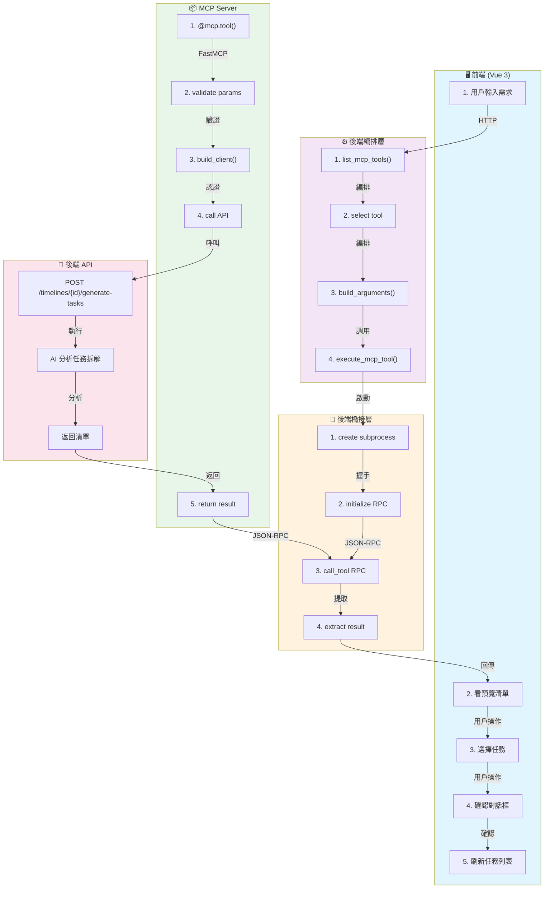

# Phase 6.3+：AI 生成任務完整流程指南

**文檔版本**: 1.0  
**發行日期**: 2026/04/07  
**目標**: 完整梳理 Copilot + MCP 生成任務的全流程，從前端到後端到 MCP 再回來

---

## 📑 目錄

1. [流程概述](#流程概述)
2. [階段 1：前端 - 用戶交互](#階段-1前端--用戶交互)
3. [階段 2：前端 - 展示預覽](#階段-2前端--展示預覽)
4. [階段 3：前端 - 最後確認](#階段-3前端--最後確認)
5. [階段 4：後端編排層](#階段-4後端編排層)
6. [階段 5：後端橋接層](#階段-5後端橋接層)
7. [階段 6：MCP 通訊層](#階段-6mcp-通訊層)
8. [階段 7：MCP Server 工具執行](#階段-7mcp-server-工具執行)
9. [階段 8：返回鏈 - 層層往上](#階段-8返回鏈--層層往上)
10. [階段 9：前端 - 顯示 + 確認 + 建立](#階段-9前端--顯示--確認--建立)
11. [完整流程圖](#完整流程圖)
12. [設計決策](#設計決策)

---

## 流程概述

```
用戶點「AI 生成」
    ↓ [前端]
輸入需求 + 選項
    ↓ [前端]
看到預覽清單 + 選擇任務
    ↓ [前端]
確認建立
    ↓ [HTTP 後端]
Gemini 決策工具 + 生成任務
    ↓ [後端編排]
JSON-RPC 呼叫 MCP Server
    ↓ [MCP 橋接]
subprocess 執行工具
    ↓ [MCP Server]
呼叫後端 API 生成任務
    ↓ [後端 API]
返回清單
    ↓ [層層返回]
前端得到結果 + 最後確認
    ↓
建立任務 + 刷新顯示
```

---

## 階段 1：前端 - 用戶交互

### 觸發點

用戶看到時間軸詳情對話框，點擊「🤖 AI 生成任務」按鈕。

```vue
<!-- TimelineDetailDialog.vue 第 12-13 行 -->
<button @click="showAiGenerateModal = true" class="...">
  <span>🤖</span> AI 生成任務
</button>
```

### 用戶輸入

Modal 打開後，用戶可以：
1. **輸入需求描述**（可選）
2. **勾選「優先使用 Copilot + MCP 工具路由」** - 決定是否用 MCP
3. **勾選「生成後直接建立任務」** - 決定是否預設全選

```vue
<!-- TimelineDetailDialog.vue 第 459-475 行 -->
<textarea
  v-model="aiPrompt"
  placeholder="例如：這個月要完成登入流程重構，請拆成後端 API、前端頁面、測試與上線準備"
/>

<label class="inline-flex items-center gap-2">
  <input v-model="useCopilotMcp" type="checkbox" />
  優先使用 Copilot + MCP 工具路由
</label>

<label class="inline-flex items-center gap-2">
  <input v-model="autoCreateAfterGenerate" type="checkbox" />
  生成後直接建立任務
</label>
```

### 發送請求

用戶點「✨ Copilot 智慧生成」，前端調用：

```typescript
// TimelineDetailDialog.vue 第 911-935 行
const generateTasksWithAi = async () => {
  isGeneratingAi.value = true;
  
  try {
    if (useCopilotMcp.value) {
      const res = await copilotService.executeMcp({
        message: aiPrompt.value,
        context: {
          timeline_id: props.selectedTimeline.id,
          timeline_name: props.selectedTimeline.name,
        },
        preferred_tool: 'timeline_generate_tasks',
        tool_arguments: {
          timeline_id: props.selectedTimeline.id,
          project_name: props.selectedTimeline.name,
          description: aiPrompt.value,
        },
        auto_create_generated_tasks: false,  // ← 永遠 false！
      });

      const payload: CopilotMcpExecuteResponse = res.data;
      aiGeneratedTasks.value = normalizeGeneratedTasks(payload.result);
    } else {
      // 直接調後端 API（不過 MCP）
      const res = await timelineService.generateTasks(
        props.selectedTimeline.id, 
        { name: props.selectedTimeline.name, description: aiPrompt.value }
      );
      aiGeneratedTasks.value = normalizeGeneratedTasks(res.data);
    }
  } finally {
    isGeneratingAi.value = false;
  }
};
```

---

## 階段 2：前端 - 展示預覽

### 關鍵改進

即使勾選「生成後直接建立」，也**永遠顯示預覽**，讓用戶有機會調整。

```typescript
// 根據用戶選擇決定預選狀態
selectedAiTasks.value = autoCreateAfterGenerate.value 
  ? aiGeneratedTasks.value.map((_, i) => i)  // 預設全選
  : [];  // 空選，用戶手動選
```

### 預覽 UI

```vue
<!-- TimelineDetailDialog.vue 第 478-505 行 -->
<div v-else class="space-y-4">
  <div class="flex items-center justify-between mb-4">
    <p class="text-sm text-gray-600">
      共 {{ aiGeneratedTasks.length }} 個建議任務，已選 {{ selectedAiTasks.length }} 個
    </p>
    <div class="flex gap-2">
      <button @click="toggleAllAiTasks" class="text-sm text-primary hover:underline">
        {{ selectedAiTasks.length === aiGeneratedTasks.length ? '全部取消' : '全部選取' }}
      </button>
      <button @click="aiGeneratedTasks = []; selectedAiTasks = []" class="text-sm text-gray-400">
        重新生成
      </button>
    </div>
  </div>

  <!-- 任務列表 -->
  <div class="space-y-3 max-h-80 overflow-y-auto">
    <div 
      v-for="(task, index) in aiGeneratedTasks" 
      :key="index"
      @click="toggleAiTaskSelection(index)"
      :class="['p-4 rounded-xl border-2 cursor-pointer', 
               selectedAiTasks.includes(index) ? 'border-purple-400 bg-purple-50' : 'border-gray-200']"
    >
      <div class="flex items-start gap-3">
        <!-- 勾選框 -->
        <div :class="['w-6 h-6 rounded-full border-2 flex items-center justify-center', 
                      selectedAiTasks.includes(index) ? 'border-purple-500 bg-purple-500' : 'border-gray-300']">
          <span v-if="selectedAiTasks.includes(index)" class="text-white text-xs">✓</span>
        </div>
        
        <!-- 任務内容 -->
        <div class="flex-1">
          <div class="flex items-center gap-2 mb-1">
            <span class="font-medium text-gray-800">{{ task.name }}</span>
            <span :class="['text-xs px-2 py-0.5 rounded-full font-medium', getPriorityClass(task.priority)]">
              {{ getPriorityLabel(task.priority) }}
            </span>
          </div>
          <div class="flex items-center gap-3 text-xs text-gray-500">
            <span>📅 {{ formatDate(task.start_date) }} - {{ formatDate(task.end_date) }}</span>
            <span v-if="task.tags">🏷️ {{ task.tags }}</span>
          </div>
          <p v-if="task.remark" class="text-sm text-gray-500 mt-1">{{ task.remark }}</p>
        </div>
      </div>
    </div>
  </div>

  <!-- 按鈕 -->
  <div class="flex gap-3 pt-2">
    <button @click="showAiGenerateModal = false" class="flex-1 py-2.5 border border-gray-200 text-gray-600 font-medium rounded-xl">
      取消
    </button>
    <button 
      @click="batchCreateAiTasks" 
      :disabled="selectedAiTasks.length === 0"
      :class="['flex-1 py-2.5 font-semibold rounded-xl', 
               selectedAiTasks.length > 0 ? 'bg-linear-to-r from-purple-500 to-indigo-500 text-white' : 'bg-gray-100 text-gray-400 cursor-not-allowed']"
    >
      新增選取任務 ({{ selectedAiTasks.length }})
    </button>
  </div>
</div>
```

### 用戶交互

- **點擊任務卡片**：切換勾選狀態
- **點「全部選取」**：預選所有任務
- **點「全部取消」**：清空所有選擇
- **點「重新生成」**：回到輸入界面
- **點「取消」**：關閉 Modal 不建立
- **點「新增選取任務」**：進入最後確認

---

## 階段 3：前端 - 最後確認

### 確認對話框

用戶點「新增選取任務」後，出現最後確認：

```typescript
// TimelineDetailDialog.vue 第 977-1005 行
const batchCreateAiTasks = async () => {
  if (!props.selectedTimeline || selectedAiTasks.value.length === 0) return;
  
  // ⚠️ 最後確認：讓用戶再次確認要建立的任務數量
  if (!await confirm({ 
    title: `確定要新增 ${selectedAiTasks.value.length} 個任務？`,
    message: '建立後可在任務列表中編輯或刪除。'
  })) {
    return;  // ← 用戶點取消，停止！
  }
  
  const timelineId = props.selectedTimeline.id;
  const tasksToCreate: CreateTaskPayload[] = selectedAiTasks.value
    .map(i => aiGeneratedTasks.value[i])
    .filter((task): task is AiGeneratedTask => Boolean(task))
    .map(task => mapToCreateTaskPayload({
      name: task.name,
      start_date: task.start_date ?? null,
      end_date: task.end_date ?? null,
      priority: task.priority,
      tags: task.tags ?? null,
      task_remark: task.task_remark ?? task.remark ?? null,
      timeline_id: timelineId,
    }));
  
  try {
    // 呼叫後端直接建立（不過 MCP 了）
    await timelineService.batchCreateTasks(timelineId, tasksToCreate);
    
    // 清理 Modal 狀態
    showAiGenerateModal.value = false;
    aiGeneratedTasks.value = []; 
    selectedAiTasks.value = [];
    
    // 觸發重新整理
    emit('refresh-all');
  } catch (err: unknown) { 
    toast.error(getApiErrorMessage(err, '批量新增失敗')); 
  }
};
```

---

## 階段 4：後端編排層

### 端點

```
POST /api/copilot/mcp/execute
Content-Type: application/json
Authorization: Bearer {access_token}

{
  "message": "拆成登入、支付、報表三個 sprint",
  "context": { 
    "timeline_id": 42,
    "timeline_name": "Phase 6.4 Group Sync"
  },
  "preferred_tool": "timeline_generate_tasks",
  "tool_arguments": {
    "timeline_id": 42,
    "project_name": "Phase 6.4 Group Sync",
    "description": "拆成登入、支付、報表三個 sprint"
  },
  "auto_create_generated_tasks": false
}
```

### 流程

```python
# backend/services/copilot_service.py 第 334-340 行
def execute_copilot_mcp_request(
    user_message: str,
    context: dict[str, Any] | None = None,
    preferred_tool: str | None = None,
    tool_arguments: dict[str, Any] | None = None,
    auto_create_generated_tasks: bool = False,
    access_token: str | None = None,
) -> dict[str, Any]:
    """
    編排層職責：
    1. 列出工具
    2. 選擇或驗證工具
    3. 構建參數
    4. 呼叫 MCP 執行
    5. 組成回應
    """
    
    # Step 1: 列出所有 MCP 工具
    try:
        tools = list_mcp_tools(access_token=access_token)
    except MCPBridgeError as exc:
        raise CopilotOperationError(f"讀取 MCP 工具失敗：{exc.message}", exc.status_code) from exc
    
    tool_names = {str(tool.get("name") or "") for tool in tools}
    
    # Step 2: 選擇工具
    if preferred_tool:
        # 用戶指定工具
        selected_tool = str(preferred_tool).strip()
        if selected_tool not in tool_names:
            raise CopilotOperationError(f"找不到指定工具：{selected_tool}", 400)
        selected_arguments = {}
        selection_source = "preferred_tool"
    else:
        # AI 決策（Gemini 選擇）
        selected_tool, selected_arguments, selection_source = _ai_select_tool(
            message, normalized_context, tools
        )
        if selected_tool not in tool_names:
            raise CopilotOperationError(f"AI 選擇了不存在的工具：{selected_tool}", 500)
    
    # Step 3: 構建最終參數
    final_arguments = _build_arguments(
        selected_tool,
        selected_arguments,
        normalized_context,
        message,
        preferred_arguments,
    )
    
    # Step 4: 呼叫 MCP 執行工具
    try:
        execution = execute_mcp_tool(
            selected_tool, 
            final_arguments, 
            access_token=access_token
        )
    except MCPBridgeError as exc:
        raise CopilotOperationError(exc.message, exc.status_code) from exc
    
    # Step 5: 組成回應
    result = execution.get("parsed_result")
    response_payload: dict[str, Any] = {
        "message": "Copilot 已透過 MCP 執行工具",
        "selected_tool": selected_tool,
        "selection_source": selection_source,
        "arguments": final_arguments,
        "result": result,
    }
    
    return response_payload
```

---

## 階段 5：後端橋接層

### 職責

連接 Flask 後端和 MCP Server 子程序，處理 JSON-RPC 2.0 通訊。

### 啟動子程序

```python
# backend/services/mcp_bridge_service.py 第 230-251 行
def execute_mcp_tool(
    tool_name: str,
    arguments: dict[str, Any] | None = None,
    access_token: str | None = None,
) -> dict[str, Any]:
    """
    執行 MCP 工具的主入口
    
    流程：
    1. 準備環境（傳遞 access_token）
    2. 啟動 subprocess
    3. 初始化握手
    4. 列出工具驗證
    5. 呼叫工具
    6. 提取結果
    """
    
    env_overrides = _build_env_overrides(access_token)
    
    with _MCPSubprocessClient(env_overrides=env_overrides) as client:
        # __enter__() 觸發：
        # 1. _start_process() - 啟動 subprocess
        # 2. _initialize() - JSON-RPC 握手
        
        # 列出工具並驗證
        tools = client.list_tools()
        tool_names = {str(tool.get("name") or "") for tool in tools}
        
        if tool_name not in tool_names:
            raise MCPBridgeError(f"找不到工具：{tool_name}", 400)
        
        # 呼叫工具
        raw_result = client.call_tool(tool_name, arguments or {})
        
        # 提取結構化結果
        parsed_result = _extract_structured_result(raw_result)
    
    return {
        "tool_name": tool_name,
        "raw_result": raw_result,
        "parsed_result": parsed_result,
        "available_tools": tools,
    }
```

### Subprocess 啟動

```python
# backend/services/mcp_bridge_service.py 第 44-56 行
def _start_process(self) -> None:
    """啟動 MCP Server 子程序"""
    
    project_root = Path(__file__).resolve().parents[2]  # 項目根目錄
    server_script = Path(os.getenv(
        "MCP_SERVER_SCRIPT", 
        str(project_root / "mcp_server.py")
    )).resolve()
    
    python_exec = os.getenv("MCP_SERVER_PYTHON", sys.executable)
    
    if not server_script.exists():
        raise MCPBridgeError(f"找不到 MCP Server 檔案：{server_script}", 500)
    
    env = os.environ.copy()
    env.update(self.env_overrides)  # 加入 PRAJEKT_ACCESS_TOKEN
    
    try:
        self._process = subprocess.Popen(
            [python_exec, str(server_script)],
            cwd=str(project_root),
            env=env,
            stdin=subprocess.PIPE,
            stdout=subprocess.PIPE,
            stderr=subprocess.PIPE,
            text=True,
            bufsize=1,  # 行緩衝
        )
    except OSError as exc:
        raise MCPBridgeError(f"啟動 MCP Server 失敗：{exc}", 500) from exc
```

---

## 階段 6：MCP 通訊層

### JSON-RPC 2.0 通訊

通過 subprocess stdin/stdout 發送 JSON-RPC 2.0 請求和回應。

#### 初始化握手

```python
# backend/services/mcp_bridge_service.py 第 161-171 行
def _initialize(self) -> None:
    """初始化握手"""
    self._send_rpc(
        "initialize",
        {
            "protocolVersion": "2024-11-05",
            "capabilities": {},
            "clientInfo": {
                "name": "prajekt-backend-copilot",
                "version": "1.0.0",
            },
        },
    )
```

**發送**:
```json
{
  "jsonrpc": "2.0",
  "id": 1,
  "method": "initialize",
  "params": {
    "protocolVersion": "2024-11-05",
    "capabilities": {},
    "clientInfo": {"name": "prajekt-backend-copilot", "version": "1.0.0"}
  }
}
```

**接收**:
```json
{
  "jsonrpc": "2.0",
  "id": 1,
  "result": {
    "protocolVersion": "2024-11-05",
    "capabilities": {...},
    "serverInfo": {"name": "prajekt-phase6"}
  }
}
```

#### 列出工具

```python
# backend/services/mcp_bridge_service.py 第 178-184 行
def list_tools(self) -> list[dict[str, Any]]:
    result = self._send_rpc("tools/list", {})
    tools = result.get("tools", [])
    if isinstance(tools, list):
        return [tool for tool in tools if isinstance(tool, dict)]
    return []
```

**發送**:
```json
{
  "jsonrpc": "2.0",
  "id": 2,
  "method": "tools/list",
  "params": {}
}
```

**接收**:
```json
{
  "jsonrpc": "2.0",
  "id": 2,
  "result": {
    "tools": [
      {
        "name": "timeline_generate_tasks",
        "description": "透過既有 API 產生專案任務建議。",
        "inputSchema": {
          "type": "object",
          "properties": {
            "timeline_id": {"type": "integer"},
            "project_name": {"type": "string"},
            "description": {"type": "string"}
          },
          "required": ["timeline_id"]
        }
      },
      ...
    ]
  }
}
```

#### 呼叫工具

```python
# backend/services/mcp_bridge_service.py 第 186-194 行
def call_tool(
    self, 
    tool_name: str, 
    arguments: dict[str, Any] | None = None
) -> dict[str, Any]:
    return self._send_rpc(
        "tools/call",
        {
            "name": tool_name,
            "arguments": arguments or {},
        },
    )
```

**發送**:
```json
{
  "jsonrpc": "2.0",
  "id": 3,
  "method": "tools/call",
  "params": {
    "name": "timeline_generate_tasks",
    "arguments": {
      "timeline_id": 42,
      "project_name": "登入重構",
      "description": "拆成登入、支付、報表"
    }
  }
}
```

**接收**:
```json
{
  "jsonrpc": "2.0",
  "id": 3,
  "result": {
    "tasks": [
      {"name": "登入 API", "priority": 1, "start_date": "2026-04-07", ...},
      {"name": "支付整合", "priority": 1, "start_date": "2026-04-10", ...},
      ...
    ]
  }
}
```

---

## 階段 7：MCP Server 工具執行

### 工具定義

```python
# mcp_server.py 第 199-231 行
@mcp.tool()
def timeline_generate_tasks(
    timeline_id: int,
    project_name: str = "",
    description: str = "",
) -> dict[str, Any]:
    """透過既有 API 產生專案任務建議。

    Args:
        timeline_id: PrAjeKt 專案 ID。
        project_name: 可選，覆寫專案名稱。
        description: 可選，補充需求描述。

    Returns:
        `POST /api/timelines/{timeline_id}/generate-tasks` 的回應 payload。
    """

    # Step 1: 參數驗證
    if timeline_id <= 0:
        raise ValueError("timeline_id 必須是正整數。")

    # Step 2: 準備 payload
    payload: dict[str, Any] = {}
    if isinstance(project_name, str) and project_name.strip():
        payload["name"] = project_name.strip()
    if isinstance(description, str) and description.strip():
        payload["description"] = description.strip()

    # Step 3: 建立 API 客戶端
    client = _build_client()
    # 注意：子程序繼承環境變數，會自動取得 PRAJEKT_ACCESS_TOKEN

    # Step 4: 呼叫後端 API
    _, result = client.call_api(
        "POST",
        f"/timelines/{timeline_id}/generate-tasks",
        payload=payload,
        accept_status={200},
    )
    
    # Step 5: 返回結果
    return result
```

### 執行流程

```
FastMCP 收到 JSON-RPC 要求
    ↓
1. 解析 tool_name = "timeline_generate_tasks"
2. 驗證參數 (timeline_id, project_name, description)
3. 呼叫對應的 Python 函式
    ↓ timeline_generate_tasks(timeline_id=42, ...)
    ├─ 驗證 timeline_id > 0
    ├─ 準備請求 payload
    ├─ 建立 API 客戶端
    ├─ 呼叫 POST /api/timelines/42/generate-tasks
    └─ 返回 {"tasks": [...]}
    ↓
4. FastMCP 自動轉換為 JSON-RPC response
    ↓
{"jsonrpc": "2.0", "id": 3, "result": {"tasks": [...]}}
    ↓
5. 寫到 subprocess stdout
```

### 錯誤回應

如果拋出異常，FastMCP 自動轉換為 JSON-RPC 錯誤：

```python
if timeline_id <= 0:
    raise ValueError("timeline_id 必須是正整數")
```

返回:
```json
{
  "jsonrpc": "2.0",
  "id": 3,
  "error": {
    "code": -32603,
    "message": "Internal error",
    "data": {
      "traceback": "...",
      "exception_type": "ValueError"
    }
  }
}
```

---

## 階段 8：返回鏈 - 層層往上

### 返回流程

```
MCP Server result
    ↓ FastMCP 包成 JSON-RPC response
{"jsonrpc": "2.0", "id": 3, "result": {"tasks": [...]}}
    ↓ 寫到 subprocess stdout（一行 JSON）
    ↓ mcp_bridge_service 讀取
raw_result = {"tasks": [...]}
    ↓ 提取結構化結果
parsed_result = {"tasks": [...]}
    ↓ execute_mcp_tool() 包裝
execution = {
  "tool_name": "timeline_generate_tasks",
  "raw_result": {...},
  "parsed_result": {...},
  "available_tools": [...]
}
    ↓ copilot_service 提取 result
result = {"tasks": [...]}
    ↓ 組成最終回應
response_payload = {
  "message": "Copilot 已透過 MCP 執行工具",
  "selected_tool": "timeline_generate_tasks",
  "selection_source": "preferred_tool",
  "result": {"tasks": [...]},
  "arguments": {...}
}
    ↓ Flask 轉成 JSON 返回
    ↓ HTTP 200 OK
    ↓ 前端接收結果
```

---

## 階段 9：前端 - 顯示 + 確認 + 建立

### 接收結果

```typescript
// generateTasksWithAi() 內
const res = await copilotService.executeMcp({...});
aiGeneratedTasks.value = normalizeGeneratedTasks(res.data.result);
```

### 用戶確認流程

1. **看預覽** - Modal 顯示任務清單
2. **選擇任務** - 勾選要建立的任務
3. **最後確認** - 對話框确認
4. **建立任務** - 呼叫 batchCreateAiTasks()

```typescript
const batchCreateAiTasks = async () => {
  // 最後確認
  if (!await confirm({ 
    title: `確定要新增 ${selectedAiTasks.value.length} 個任務？`,
  })) {
    return;
  }
  
  // 準備清單
  const tasksToCreate = selectedAiTasks.value
    .map(i => aiGeneratedTasks.value[i])
    .map(task => mapToCreateTaskPayload(task));
  
  try {
    // 呼叫後端直接建立（普通 REST API，不過 MCP）
    await timelineService.batchCreateTasks(
      props.selectedTimeline.id,
      tasksToCreate
    );
    
    // 清理狀態
    showAiGenerateModal.value = false;
    emit('refresh-all');
  } catch (err) {
    toast.error('批量新增失敗');
  }
};
```

### 最終效果

```
前端更新
    ↓
Modal 關閉
    ↓
任務列表刷新
    ↓
Toast 顯示成功訊息
    ↓
用戶看到新建立的任務
```

---

## 完整流程圖



---

## 設計決策

### 為什麼是這樣設計？

| 決策點 | 選擇 | 原因 |
|---|---|---|
| **工具選擇策略** | Gemini（AI）+ 關鍵字備用 | 智能優先，失敗自動降級，用戶體驗好 |
| **工具執行地點** | MCP Server 子程序 | 隔離、安全、可複用（Claude Desktop 也能用） |
| **通訊協議** | JSON-RPC 2.0 + stdio | 標準、跨平台、測試友善 |
| **確認流程** | 前端預覽 + 最後確認 | 用戶完全掌控，防止誤操作 |
| **自動建立選項** | 只做預選，不跳過預覽 | 即使勾選也給用戶改變主意的機會 |
| **參數傳遞** | 環境變數 (token) | 子程序簡單繼承，無額外複雜度 |
| **直接建立任務** | 不過 MCP，用普通 API | MCP 用於決策層，不用於執行層 |

### 職責邊界

```
前端職責：
  ✅ 展示 UI
  ✅ 收集用戶輸入
  ✅ 預覽和確認機制
  ❌ 不做決策（工具選擇由後端/AI 做）

後端編排層職責：
  ✅ 工具選擇邏輯（AI 或關鍵字）
  ✅ 參數構建和驗證
  ✅ MCP 橋接調度
  ❌ 不做 UI 邏輯

MCP 橋接層職責：
  ✅ 子程序管理
  ✅ JSON-RPC 通訊
  ✅ 錯誤轉換
  ❌ 不做業務邏輯

MCP Server 職責：
  ✅ 被動工具提供
  ✅ 參數驗證
  ✅ API 調用
  ❌ 不做決策，不做 UI

後端 API 職責：
  ✅ 實際執行（生成、建立任務）
  ✅ 數據持久化
  ❌ 不知道 MCP 存在
```

---

## 關鍵流程檢查清單

### 前端部分

- [ ] 用戶點「AI 生成任務」
- [ ] Modal 打開，顯示輸入框
- [ ] 用戶輸入需求 + 選擇選項
- [ ] 點「Copilot 智慧生成」發送請求
- [ ] 請求中 `auto_create_generated_tasks` 始終為 `false`
- [ ] 后端返回後，Modal 顯示預覽清單
- [ ] 根據「生成後直接建立」選項決定預選狀態
- [ ] 用戶可以調整選擇（勾選/取消勾選）
- [ ] 點「新增選取任務」觸發最後確認
- [ ] 確認對話框顯示任務數量
- [ ] 用戶確認後調用 `batchCreateAiTasks()`
- [ ] 建立完成後，Modal 關閉
- [ ] 任務列表刷新
- [ ] Toast 顯示成功訊息

### 後端部分

- [ ] `/api/copilot/mcp/execute` 端點接收請求
- [ ] `copilot_service.execute_copilot_mcp_request()` 處理
- [ ] 列出所有 MCP 工具 (`list_mcp_tools()`)
- [ ] 根據 `preferred_tool` 選擇或驗證工具
- [ ] 構建最終參數 (`_build_arguments()`)
- [ ] 調用 `execute_mcp_tool()` 執行
- [ ] 返回結果組成 response

### MCP 部分

- [ ] `_MCPSubprocessClient` 啟動 subprocess
- [ ] 環境變數包括 `PRAJEKT_ACCESS_TOKEN`
- [ ] 發送 `initialize` JSON-RPC 進行握手
- [ ] 發送 `tools/list` 列出工具
- [ ] 發送 `tools/call` 執行工具
- [ ] 工具函式執行並返回結果
- [ ] JSON-RPC response 包含 `result` 或 `error`（互斥）
- [ ] 結果寫到 stdout
- [ ] 橋接層讀取並轉換

### 錯誤處理

- [ ] 工具不存在時返回 400 錯誤
- [ ] API 呼叫失敗時返回 500 錯誤
- [ ] 參數驗證失敗時返回 -32603 JSON-RPC 錯誤
- [ ] 前端捕捉錯誤並 toast 通知
- [ ] 用戶可以重新嘗試或返回

---

## 補充資源

- 詳細 MCP 文檔：[MCP_Tool_Calling_整合指南.md](MCP_Tool_Calling_整合指南.md)
- Copilot 架構：[Phase6_3_Copilot_MCP整合詳解.md](Phase6_3_Copilot_MCP整合詳解.md)
- 代碼位置：
  - 前端：`frontend/src/components/timelines/TimelineDetailDialog.vue`
  - 後端編排：`backend/services/copilot_service.py`
  - 後端橋接：`backend/services/mcp_bridge_service.py`
  - MCP Server：`mcp_server.py`
  - Flask 端點：`backend/blueprints/copilot.py`

---

**文檔完成** ✅
